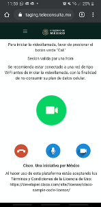
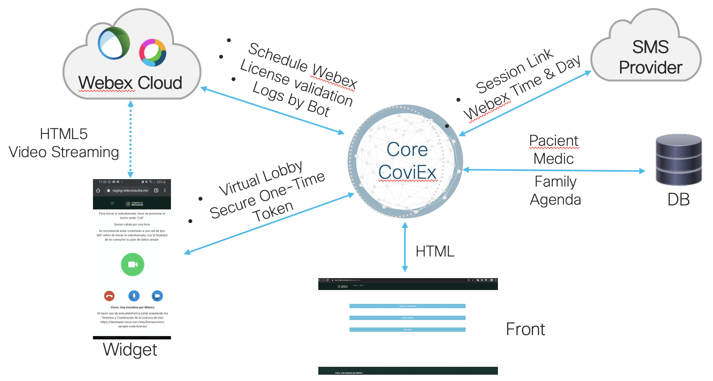

# Televisista Webex in HTML5 via SMS (NO APP) 
This repository is a template that can be used as a base to replicate the teleHealth service. 

The objective of this document is to technically detail the Tele Consultation Application that is based on the Webex video conferencing engine and that is being used at INER
<br>The application aims to:
<br>- Generate <b>accessibility</b> for people who are not native to the digital age
<br>- <b>Automate</b> and facilitate the generation of communication channels between doctors, patients and relatives
<br>- Give full <b>control</b> of these communication channels to Health personnel
<br>- <b>Integrate</b> technologies such as HTML5, Webex, and SMS to achieve the above objectives

The way in which these objectives are achieved are:
<br>1.- Via a Web page the Health personnel can generate a Webex session.
<br>2.- Then a link is sent via SMS to the relatives and patients. In this link they can access the video conference without installing any application.
<br>This is accomplished using the Webex SDK for HTML5. The user only has to <b>click 2 times</b> to enter the session. In the image below you can see an screenshot of the result once the cliente click on the link.



# Architecture

## Webex Meetings
Webex Meetings Cloud APIs are being leveraged. Which is a multipoint of audio, video and web presentation conferences with different advanced functions. Due to the context of the document we will delve into the APIs more than other advanced functions.
Since these are used to fulfill the objectives of Automation and control mentioned above; This is achieved through the following functionalities.
<br>• Generation and agenda service for the Webex Session
<br>• Generation of Users both in the application and in Webex
<br>• Assignment of necessary permissions for each user
<br>• Physician control to start the session through the virtual lobby
<br>The detail of APIs called is in the next section.

## Widget
The Webex Browser SDK generates the ability to make video calls in a browser that supports HMTL5 and JavaScript; this maintaining the security features for which Webex is known, I have even added new capabilities.
<br>The SDK is in charge of:
<br>• Join the session
<br>• Get access to the microphone and camera of the device used by the user
<br>• Control the Audio and Video codec with which it is transmitted
<br>• Deliver Audio and video control to the user
<br>All of this is accomplished by using the JS functions that are loaded together with the HTML

### Unique Token

Each user and session has a unique token with which it is valid for 1 hour. This in order to generate an extra layer of security in addition to handing over control of the communication channel to the Physician; in order to avoid that the Family members generate an overload of work.
This same unique token is used to generate the guest credentials in the Webex session.

### JWT (JSON Web Token)

The SDK requires JWT to authenticate users using HTML5.
Since the objective is that the user can enter easily (NO Logins, NO downloads), Webex's ability to automatically and safely generate guest users is used.
<br>For this, the concept of “Guest Issuers” is used, which are the credentials with which the JWT that the Widget requires is generated.
These can be generated easily and quickly in the following Link:
https://developer.webex.com/docs/guest-issuer
<br>
<br>This element could be considered part of the advanced functions but because it is used to fulfill different objectives, Accessibility and security, it was treated independently.

## Virtual Lobby

This is a functionality that puts the user on hold while the doctor does not start the session.
This lobby also displays using a. git the next steps you will have to do, give microphone and camera permissions, click the green button to start the call.
<br>It automatically lets the user pass when the Doctor is ready.


## SMS provider
An integration with an SMS messaging provider was carried out to be able to have a greater scope due to the ubiquity of this service. The SMS Message is used to send the user a link with which they can Join the Webex Session and to let them know the date and time of the scheduled sessions.

### Coviex (Core)

The Core of the application is a development in Python under the Flask Framework; At the same time, JavaScrip is used to give dynamism to HTML files.
<br>This development is based on Python 3.7 and is running on a VM with Ubuntu in the AWS EC2 service.
The Core is in charge of coordinating and communicating the different elements:
<br>• Webex administration and agenda
<br>• Lobby waiting for users
<br>Multimedia traffic at no time travels to the Core of the application.

In the next image you can see a model of the Architecture.




## Instructions

You will need next things to be able to use this Code:
<br>-A Webex with admin access to the control Hub
<br>-Enough licenses to cover the medical acounts created
<br>-A Twilio account 
<br>-A webex Teams bot
<br>-A Webex Guest Issuer 

This code is been developed in Pyhton Using th Flask Framework; with a mix of JS for the Frontend.

It is originally deployed in a Ubuntu VM with Python 3.7. the libraries and the version are represented in the reqs.txt file.

Within the file BashRunMe.sh are all the commands needed to set ready an Fresh Ubuntu VM; been an .sh file you can run it directly.

All the needed varibles must exist as environment variables . Either you add them via the CLI or you use the exampleDOTenv to create a .env file so that when run the code this add them automatically.

Once the VM is ready with  all the packages installed, python 3.7 and all the libries for python installed yo can just use the command:

```python
 python3 runme.py
 ```
This is NOT a recommended way leave it running, but you can use this to check that everything is ready.
Once everything is Ready I recommend that you use aome kind of WSGI service; in this case we will use Gunicorn.

if you run the bashRunMe.sh you should alredy get installed gunicorn; you can use the next command to keep it running:
```bash
gunicorn3 --workers=8 --bind 0.0.0.0:xxx run:app --access-logfile gunicorn.log --error-logfile gunicorn-error.log --capture-output -D
```
Let me explain a little bit datailed this command:
<br>Workers: it is recommendes that you use between 2-4 workes per Core
<br>Bind: the IP and port for the service(i reccomend that you use other than default 5000 port in flask)
<br>run:app make reference to the name of the file (without the .py) and the module to run
<br>access-logfile: the name of the to store the logs
<br>error-logfile: the name of the file where the errors logs will be stored
<br>capture-output: this force all the outputs to be store as error logs
<br>D: this make the command to run as a Deamon

To generate the video call the browser will need to ask for acces to the micfofone an the camera; all the most user browser will need a valited Cert for this.

I recommend to use another service like NGNIX as a proxy and to provide the Cert.

Contact Info:

joarriag@cisco.com

[](https://developer.cisco.com/codeexchange/github/repo/Momoyactly/PSdCloud)

